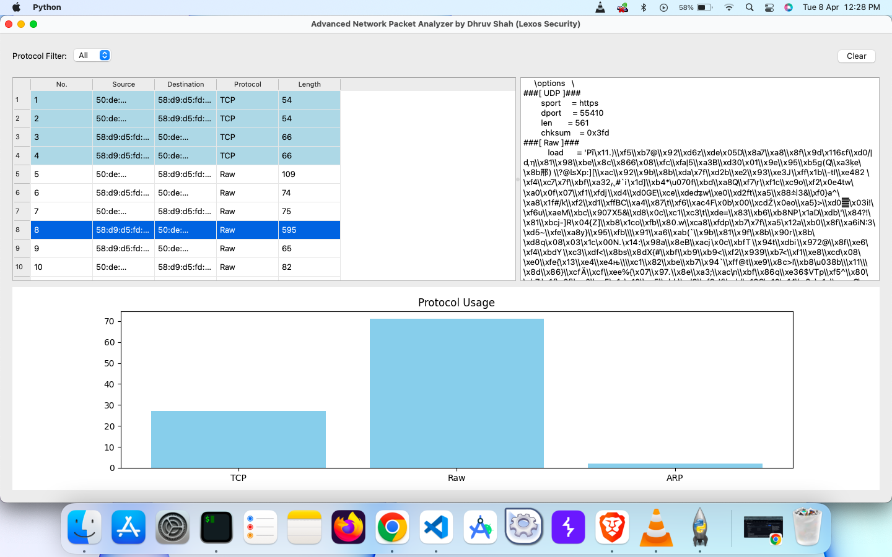

# NetAnalyzer v3

**NetAnalyzer v3** is an advanced, cross-platform network traffic analyzer built with **PyQt5** and **Scapy**. It offers real-time packet capturing, interactive protocol breakdown, dynamic graph visualization, and detailed packet inspection with a modern, user-friendly interface.

---

## 🚀 Features

- 🎯 **Live Packet Capture** – Monitor real-time traffic across selected network interfaces.
- 📊 **Interactive Graphs** – Visualize traffic trends, protocol distribution, and packet frequency.
- 🧪 **Protocol Breakdown** – Inspect layers and payloads of each packet with detailed breakdown.
- 🎨 **Color Filters** – Identify packet types instantly with dynamic, color-coded filtering.
- ⚙️ **Interface Selector** – Choose from available interfaces to begin capture.
- 🔎 **One-Click Packet Inspection** – View full packet details instantly on click.
- 📁 **Export Logs** – Save captured data to file for future analysis.
- 💻 **Cross-Platform** – Smooth performance on Windows, macOS, and Linux.

---

## 📸 Screenshot



---

## 🛠 Installation

### Prerequisites

- Python 3.8+
- pip

### Install Dependencies

```bash
pip install -r requirements.txt
